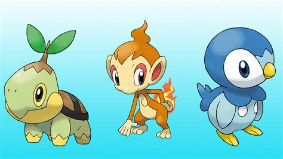

## Our mission: catch them all! 

Our main goal is to provide some insights on the pokemon world to help parents to advice their children on how to catch them all.

{fig-align="center" width=50%}

## The data

We will be using the [Pokemon](https://github.com/rfordatascience/tidytuesday/blob/main/data/2025/2025-04-01/readme.md) dataset, which contains information about all the pokemon from the first generation to the seventh generation.

```{r}
#| label: set-up

#load pacman library to load all the libraries and install if needed
library(pacman)

# Load libraries
p_load(tidyverse, #for data manipulation
        ggplot2, #for plotting
        tidytuesdayR, #to load the data
        forcats, #for factor manipulation
        farver, #for color manipulation
        knitr, #for appealing tables
        kableExtra, #for appealing tables
        skimr, #for data exploration
        viridisLite #for color palette
        )

# if we wanted to set a different working directory
# mainwd <- "C:/Users/marub/Desktop/DataSci for Management/Statistics with R/Data Visualization" 
```

```{r}
#| label: data-import

# import data pokemon from tidytuesdayR
pokemon_df <- tt_load(2025, week = 13)$pokemon_df
```

It contains in total information about `{r} nrow(pokemon_df)` pokemons studied on `{r} ncol(pokemon_df)` variables, both numerical and categorical.
After removing some null values and keeping only the most relevant ones, we will be working with **802 pokemons and 19 variables**.

## Variables {.scrollable}

```{r}
#| label: data-cleaning

# drop columns that we don't need and missing values
pokemon_df <- pokemon_df |>
  select(-c(species_id, url_icon, url_image)) |> 
  filter(!is.na(generation_id)) |> 
  mutate(pokemon = str_to_title(pokemon), #gives some format to Pokemon names.
         type_2 = ifelse(is.na(type_2), "none", type_2) |> str_to_title(),
         type_1 = str_to_title(type_1))
```

* id: the id of the pokemon (num)
* pokemon: the name of the pokemon (chr)
* height: the height of the pokemon in meters (num)
* weight: the weight of the pokemon in kilograms (num)
* base_experience: the base experience of the pokemon when catched (num)
* type_1: the primary type of the pokemon (chr)
* type_2: the secondary type of the pokemon (if it has one) (chr)
* hp: the health points of the pokemon (num)
* attack: the attack points of the pokemon (num)
* defense: the defense points of the pokemon (num)
* special_attack: the special attack points of the pokemon (num)
* special_defense: the special defense points of the pokemon (num)
* speed: the speed points of the pokemon (num)
* generation_id: the generation on wich the pokemon was introduced (num)

## The insights

We worked mainly on 4 insights:

* **Distribution of pokemons by generation** (table)
* Distribution by type (table)
* Proportion of pokemons by type (plot)
* **Distribution of stats by type** (plot)

## Distribution by generation

Let's start with the distribution of pokemons by generation. We want to understand:

* Which generation has the most pokemons?
* Which generation has the most powerful pokemons?

---

```{r}
#| label: pokemon-distribution

# to a better analysis we create to combined variables
pokemon_df = pokemon_df |> 
  mutate(comb_attack = attack + special_attack,
         comb_defense = defense + special_defense)
         
#summarise pokemon distribution by generation and main stats
interest_stats = pokemon_df |> 
  group_by(generation_id) |> 
  summarise(n = n(),
            avg_hp = mean(hp, na.rm = TRUE),
            avg_attack = mean(comb_attack, na.rm = TRUE),
            avg_defense = mean(comb_defense, na.rm = TRUE),
            avg_speed = mean(speed, na.rm = TRUE),
            total_avg_stat= sum(avg_hp,avg_attack,avg_defense,avg_speed)
)
```

```{r}
#| label: tbl-poke_distribution
#| echo: false
#| tbl-cap: "Pokemon stats by generation"

# Identify generations with the highest number of pokemons
top_gen <- rank(-interest_stats$n) <= 3

#identify the top generation on each stat
top_hp <- rank(-interest_stats$avg_hp) <= 3
top_attack <- rank(-interest_stats$avg_attack) <= 3
top_defense <- rank(-interest_stats$avg_defense) <= 3
top_speed <- rank(-interest_stats$avg_speed) <= 3
top_total <- rank(-interest_stats$total_avg_stat) <= 1

turbo=turbo(n=3, begin= 0.8, end=0.99, direction = 1) #3 color from turbo palette

# Create background color vector (only for top 3)
gen_colors <- ifelse(top_gen, spec_color(interest_stats$n, end = 0.5), "transparent") #default viridis
hp_colors <- ifelse(top_hp, spec_color(interest_stats$avg_hp, palette=turbo), "black")
at_colors <- ifelse(top_attack, spec_color(interest_stats$avg_attack, palette=turbo),"black")
def_colors <- ifelse(top_defense, spec_color(interest_stats$avg_defense, palette=turbo),"black")
sp_colors <- ifelse(top_speed, spec_color(interest_stats$avg_speed, palette=turbo),"black")
tot_colors <- ifelse(top_total, spec_color(interest_stats$total_avg_stat, palette=turbo),"black")

interest_stats |>
  kable(digits = 2) %>%
  kable_styling(bootstrap_options = c("striped", "hover", "condensed", "responsive"),
                full_width = F, position = "center") |> #some styling options for the table
  column_spec(2, background = gen_colors) |> #backwround color for 2 column (number of pokemons)
  column_spec(3, color = hp_colors, bold = top_hp) |> #color and bold for hp column
  column_spec(4, color = at_colors, bold = top_attack) |> 
  column_spec(5, color = def_colors, bold = top_defense) |> 
  column_spec(6, color = sp_colors, bold = top_speed)
```

---

The most populated generations are **the 1st, 3rd and 5th**, highlighted in blue in the table.

Nevertheless, the most powerfull generation considering all four stats (combined attack, combined defense, hp and speed) is **the 4th generation**. 



## Distribution of stats by type
We can also analyze the distribution of stats by type to see which types are more powerful.

We used a bar-plot, in which each color represents a stat.


---

```{r}
#| label: type-stats
#| echo: false

#new interest stats by type
interest_stats_type = pokemon_df |> 
  group_by(type_1) |> 
  summarise(n = n(),
            avg_hp = mean(hp, na.rm = TRUE),
            avg_attack = mean(comb_attack, na.rm = TRUE),
            avg_defense = mean(comb_defense, na.rm = TRUE),
            avg_speed = mean(speed, na.rm = TRUE)
)

# apply focus on the types that have more than 20 pokemons
 finterest_stats = interest_stats_type |> 
  filter(n > 20) |> 
   pivot_longer(cols = -type_1, names_to = "stat", values_to = "value")

#grouped bar graph for stats by type
ggplot(data=finterest_stats, aes(x=type_1, y=value, fill=stat)) +
geom_bar(stat="identity", position=position_dodge())

```

## Conclusions

Which pokemon is the best choice?